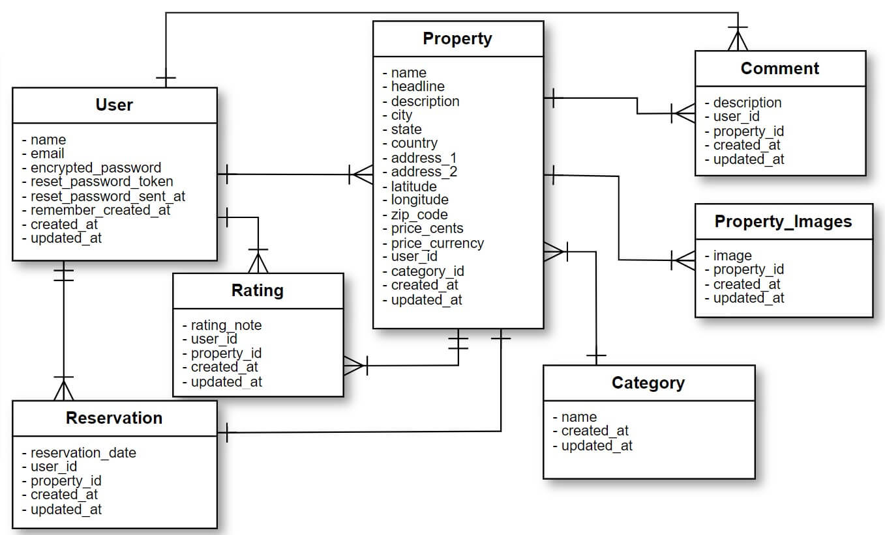
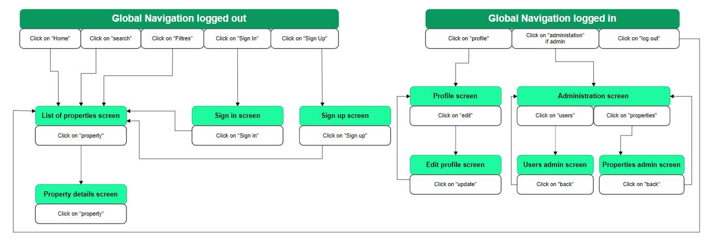

# README YelbApp

## Development Language

* Ruby 3.0.1
* Rails 6.0.3

## Employment Term Technology

- devise
- Comment function
- Heroku

## Technology outside the curriculum

- Geocoder

## Execution Procedure

```
git clone https://github.com/zidajoseph/YelbApp.git
cd YelbApp
bundle install
rails db:create
rails db:migrate
rails s
```

## Check Sheet, Catalog Design and Table Definition Document

[Checksheet, Catalog Design, and Table Definition Share Link](https://docs.google.com/spreadsheets/d/134xWXE_yQOAw0DTBpB2TZuACIfQuCVyJMZaTg76nkc8/edit?usp=sharing)

## Wireframe


### ER Diagram



## Screen Transition Diagram
